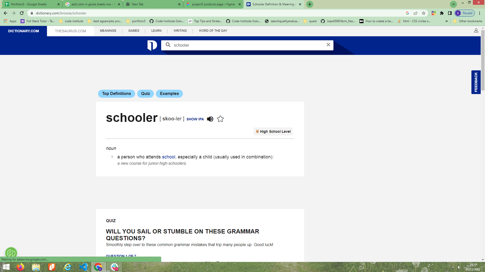
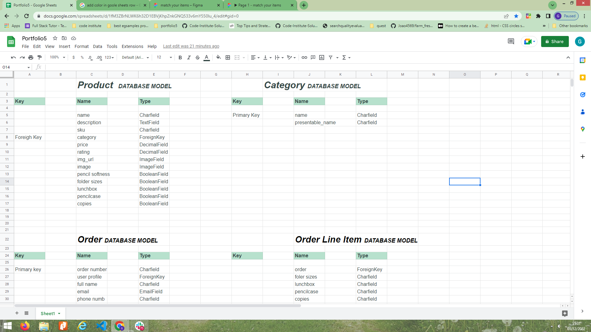
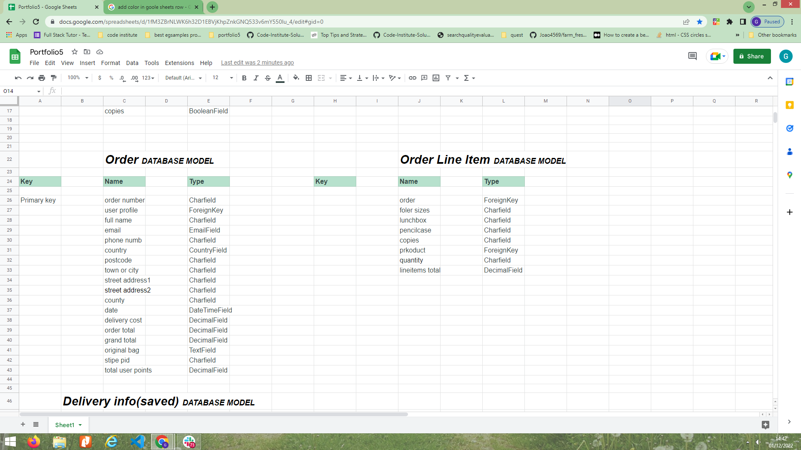
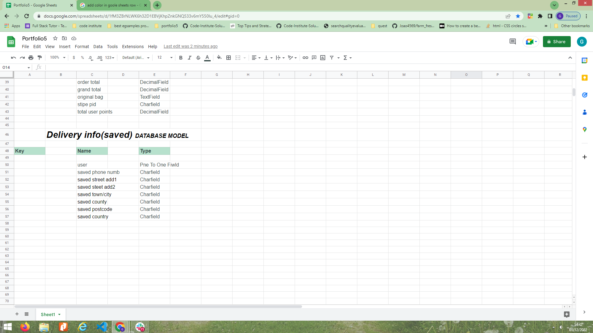
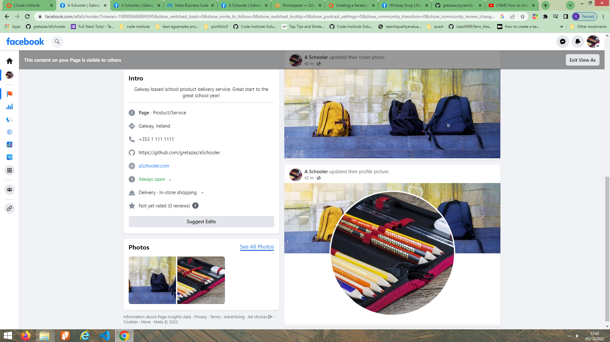
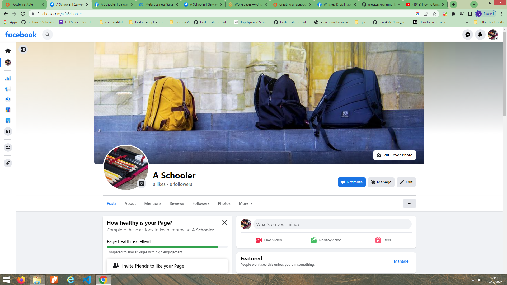

## Introduction
Link to gitHub:
<a href="https://github.com/gretazas/aSchooler">https://github.com/gretazas/aSchooler</a>

## Table of Contents
* [Project Planning](#project-planning)
* [Agile](#agile)
    * [User Stories](#user-stories)
    * [Project Dtabase Scope](#project-database-scope)
    * [Project Setup](#project-setup)
    * [Project Management](#project-management)
    * [Features](#features)
    * [Features - Features Left To Implement](#features-left-to-implement)
    * [Products](#products)
        * [Create An Account](#create-an-account)
        * [Create an order](#create-an-order)
        * [View an order](#view-an-order)
        * [View Your order history](#view-your-order-history)
        * [Delete Items](#delete-items)
        * [Create Your Profile](#create-your-profile)
        * [Edit Your Profile shipping details](#edit-your-profile-shipping-details)
        * [Admin](#admin)

* [Basic Wireframe Design](#basic-wireframe-design)
    * [Landing Page Wireframe](./extrareadme.md)
    * [Products Page Wireframe](./extrareadme.md)
    * [Product Detail Page Wireframe](./extrareadme.md)
    * [Shopping Cart Wireframe](./extrareadme.md)
    * [Mix And Match Products Wireframe](./extrareadme.md)
                
* [Kanban Example](#kanban-example)
* [Web Marketing](#web-marketing)
* [SEO Optimization](#seo-optimization)
* [Stripe payments](#stripe-payments)
* [Testing](#testing)
    * [Automated Testing](#automated-testing)
    * [Django Coverage report](#django-coverage-report)
    * [Manual Testing](#manual-testing)
    * [Pep8 and Pylint Python Validators](#pep8-and-pylint-python-validators)
    * [HTML Validation with Official W3C Validator](#html-validation-with-official-w3c-validator)
    * [CSS Validation with Official W3C Validator](#css-validation-with-official-w3c-validator)
    * [LightHouse testing](#lighthouse-testing)
    * [Responsive testing](#responsive-testing)
* [Bugs](#bugs)
* [Existing Bugs](#existing-bugs)
* [Deployment](#deployment)
* [Deployment on Heroku](#deployment-on-heroku)
* [Heroku Deployment - Setting up AWS](#heroku-deployment---setting-up-aws)
* [MVT Architecture](#mvt-architecture)
* [Django AdminUser](#django-adminuser)
* [Used Technologies](#used-technologies)
* [Frameworks and Libraries used](#frameworks-and-libraries-used)
* [Credits](#credits)

### Project Planning

* Create a personal user account.
	- order history, saved shipping details.

* Use allauth for login to user account.
	- Secure way to register, login, log out.

* Have access to secure checkout.
	- Using Stripe.

* Admin access to all products, orders, shipping details.
	- Admin access allows to view orders.

### Agile

* [Basic Wireframe Design](#basic-wireframe-design)
* [Kanban Example](#kanban-example)

### User Stories

* Viewing and navigation

    * As a Shopper I can View a list of products so tnat I can Select some to purchase
    * As a Shopper I can View individual product details so tnat I can Find out about the product price, product itself, rating, view image, search for right sizes
    * As a Shopper I can Search for deals Get great deals and offers on certain products
    * As a Shopper I can Easy view the total of all purchases at all times so tnat I can Easy to see how close I am to the spending limit

* Registration and User Accounts
    * As a Site User I can Register to the Account so that I can Have a personal account i can view my profile, order history, aved shipping and billing details
    * As a Site User I can Easy to login or logout so that I can Access my personal account information
    * As a Site User  I canEasily recover  password so that I can Recover access to my account if needed 
    * As a Site User I can Receive an email conformaition after registering so that I can Reinsurance that registration was successful

* Sorting and searching
    * As a Shopper I can Sort the list of products so that I can Easy identify the best rated products, and sort them by preferred 
    * As a Shopper I can Sort specific category of product so that I can Find best priced or best rated products
    * As a Shopper I can Find the product by name or description so that I can Find specific product to purchase
    * As a Shopper I can Easy see what I've searched for and how many items found

* Purchasing and Checkout
    * As a Shopper I can Easiely select the size and quantity of the product when purchasing it so that I can Ensure I've selected the right products

### Project Database Scope

Product/Category Model:

Order/LineItems Model:

Delivery info Model:

(<a href="#top">Back to top</a>)

## Project Setup

## Project Management
GitHub's KanBan board to manage my workflow. 
* Three columns:
    - todo
    - in progress
    - done

The board allowed me to easily drag my stories through the business delivery lifecycle of: To Do -> In Progress -> Completed.

## Features

    Import:
        - datetime
        - pandas as pd
        - start = datetime.datetime.strptime("01-12-2021", "%d-%m-%Y")
        - end = datetime.datetime.strptime("07-12-2021", "%d-%m-%Y")
        - date_generated = pd.date_range(start, end)
            - Greatings according to season:
            - if September f"Back to School!"
            - elif December f"Happy Christmas!!!"
            - elif February f"Happy Valentine`s Day!"
            - elif March/april f"Happy Easter!"
            - elif August f"Sale! 10% off with any purchase!"
            - else f"delivery free with purchase of {{ FRE_DELIVERY_TRESHOLD}}€!"

## Features left to implement
- Login via social media account, eg. facebook or google.

(<a href="#top">Back to top</a>)

### Products
 - categories: 
 - info : sku, order numb

### Create An Account

### Create an order

### View an order

### View Your order history
Users have an ability to view their own order history.

### Delete Items
By setting your quantity to 0 user deletes the item from the order line items.

(<a href="#top">Back to top</a>)

### Create Your Profile

### Edit Your Profile shipping details

### Admin

### Basic Wireframe Design

* [Basic Wireframe Design](./extrareadme.md)

### Kanban Example

(<a href="#top">Back to top</a>)

### Web Marketing
- Facebook
    - 
    - 
- Subscriptions

### SEO Optimization

- For Googles search engine:

    - I Googled similar products fields and:

    - Created meta tags with a description keywords.
    - Made use of good semantics.
    - Customed image names to the subject of the image using `alt` attribute.
    - Contented of the site matches the purpose.
    - Created `sitemap.xml` file.
    - Created `robots.txt` file.

## Stripe payments

## Testing

### Automated Testing

* TestCase

#### Django Coverage report

### Manual Testing

### Pep8 and Pylint Python Validators

### HTML Validation with Official W3C Validator

### CSS Validation with Official W3C Validator

(<a href="#top">Back to top</a>)

### LightHouse testing

### Responsive testing

## Bugs

## Existing Bugs

(<a href="#top">Back to top</a>)

## Deployment

Deployment procedure (using Heroku):

### Deployment on Heroku

- Create a Heroku app within Heroku.
- Give project "alfaSchooler" name
- Set Postgres database on Heroku.
- Create an env.py file in your root directory and import the os library within this file.
- Within your env.py file, create environment variables for your DATABASE_URL and SECRET_KEY.
- Assign a values to DATABASE_URL and SECRET_KEY and within the Heroku settings tab, create corresponding Config Variables.
- Set `ALLOWED_HOSTS` in settings.py
- Run migrations for the new Postgres database.
- Heroku configurations.
- Create Procfile to tell Heroku to create a web dyno which will run gunicorn and serve our Django app.
- Push all changes and attempted the initial deployment on Heroku.
- Heroku builds the app, if the built is successful.

### Heroku Deployment - Setting up AWS

- Set Amazon Web Services S3 - cloud based storage service - for storing static and media files.
    - Create a new bucket to store files.
    - Make publicly accessible..
    - New endpoint.
    - Set access between the Heroku app and S3 bucket.
    - Bucket policy section access policy generator to create a security policy.
    - Copy the ARN paste into the ARN box, add the statement and generated a policy.
    - Copy this policy into the bucket policy editor.
    - I proceeded to the access control list section and set the list objects permission for everyone under the Public Access section.
    - Create a group.
    - Import pre-built policy.
    - Attach the policy to the group.
    - Created a user.
    - Download the CSV file with users access key and secret access key.
    - Create a new folder "media" for all media files.
    - Grant public read access to these objects.
- Install boto3 and django-storage.
- Set settings.py with a statement: if there's an environment variable called `USE_AWS` in the environment. 
    - Define the bucket name, the AWS region name, the access key and secret access key 
    - Keep access key and secret access hiding in environment variables.
    - Create a string to tell Django location of static files, containing the AWS S3 bucket name to generate the appropriate URL.
    - Set static file storage and the location.
    - Set imports.
    - Set the default file storage/ media files locations.
    - Set the URLs for static and media files using the custom domain and the new locations.
    - Add  `AWS_S3_OBJECT_PARAMETERS`.
    - 
- In Heroku add the AWS keys to the configuration variables.
    - Remove the collect static variable from config vars.
    - Add stripe keys to the Heroku config vars.
    - Add the URL `/checkout/WH`.
    - Add webhooks signing secret to the Heroku config vars.

- Stripe webpage.
    - Add a new webhook endpoint.

## MVT Architecture

## Django AdminUser

## Used Technologies
* HTML
* CSS
* Python
* JavaScript

## Frameworks and Libraries used
* Django with;
    * gunicorn
    * psycopg2
    * postgresql
    * AllAuth
    * Crispy Forms
    * colorfield
* Bootstrap

## Credits
  

- [temp-mail.org](https://temp-mail.org/en/)
- [miniwebtool.com](https://miniwebtool.com/django-secret-key-generator/)
- [XML-Sitemaps.com](https://www.xml-sitemaps.com/)
- [Privacy Policy Generator](https://www.privacypolicygenerator.info/)
- [CSS tricks](https://css-tricks.com/snippets/css/css-triangle/)

  
(<a href="#top">Back to top</a>)
